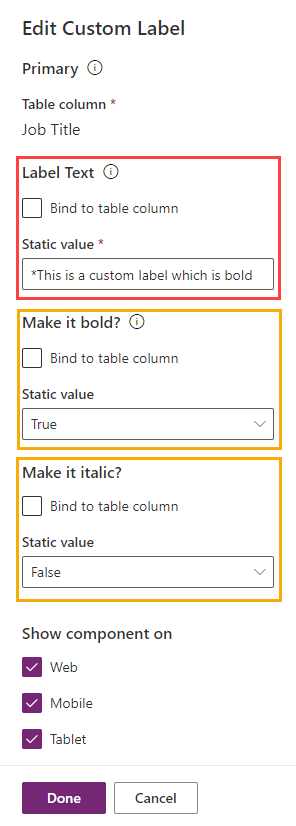
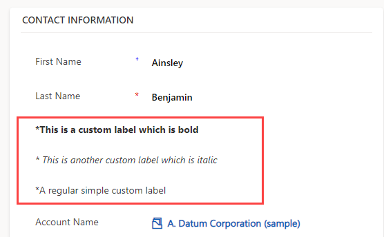

# Custom Label Control

A label control that allows you to show static text with ability to make it bold and/or italic.

### Configure the control

Control has 4 configuration properities which are described below:

| Configuration Property | Description                                 | Required |
| ---------------------- | ------------------------------------------- | -------- |
| Primary                | The bound field that needs to show Chat GPT | Yes      |
| Label Text             | Provide the label text you want to display  | Yes      |
| Make it bold?          | Make the entire label text as bold          | No       |
| Make it italic?        | Make the entire label text as italic        | No       |

### Screenshot of the configuration

### Demo Screenshot

### Demo Video

To be released soon.

> If you have any feature request then please create an issue with tag: `CustomLabel`
