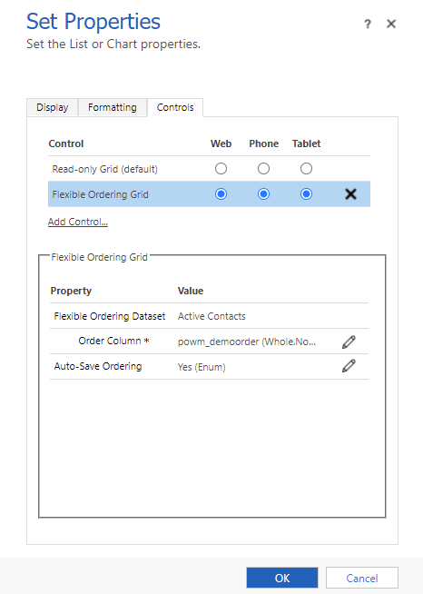
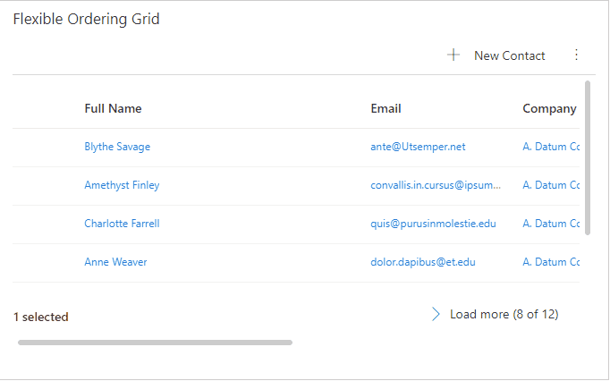
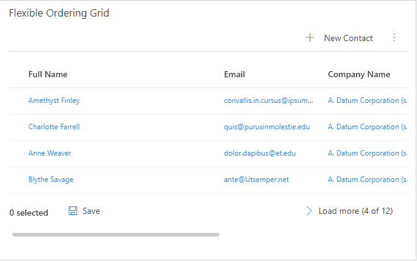

# Flexible Ordering List Control

A fully configurable PCF dataset control that helps the user sets their own ordering on the records by using drag & drop feature. It has auto-save as well as manual save feature.

## Configure the control

Control has 2 configuration property. One is on the sub-grid named `Order Column` that is required and is used for setting the order of the records. The second property is a choice that allows to configure the grid/view which will auto-save the ordering when user moves the records around or manual which will display a **Save** button (auto-save is the default). The latter will not save until user clicks on the **Save** button and if user navigates away from the screen without saving there will be no prompt and all changes will be lost.

## Screenshot of the configuration

## Demo of the control

#### With Auto-Save Enabled

#### With Manual-Save Enabled

