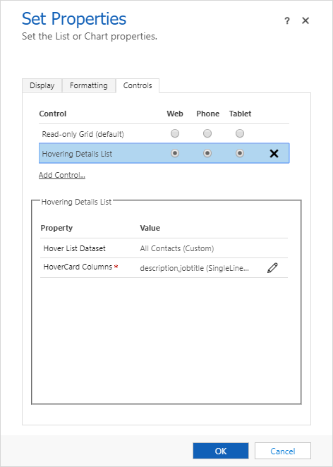

# Hover Details List Control
A fully configurable PCF dataset control that is built using HoverCard and Details List utilizing React and Office UI Fabric.

### Configure the control
Control has only 1 configuration property which is described below:

Configuration Property | Description | Required
------------ | ------------- | -------------
HoverCard Columns | Comma-separated columns that should show HoverCard | Yes

### Screenshot of the configuration

### Demo of the control

