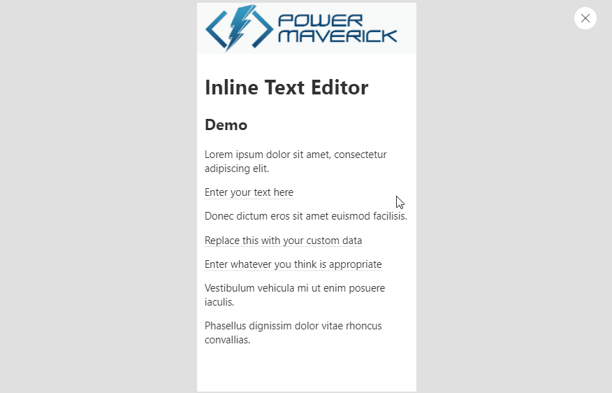

# Inline Text Editor

A control that accepts HTML text and renders part of HTML content as editable. When user edits the data it returns the edited version of HTML back to the host. This control is supported on **canvas apps**.

### Configure the control

Control has 3 configuration properities which are described below:

Configuration Property | Description | Required
------------ | ------------- | -------------
HTML Preview Text | HTML text that needs to be previewed along with slugs. | Yes
Slugs Replacement Config | A JSON string that will define which words to find, replace and make then editable. | Yes
Font Size | A default font size that the control should render. | No

### Demo

### Demo of the control

TBD
