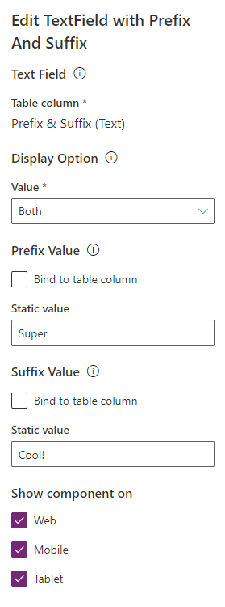
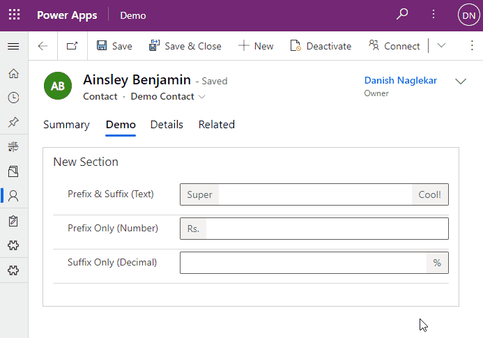

# Prefix & Suffix Text Field Control

<!--  -->

A control that provides the flexibility to show prefix and suffix on the control without saving that to the database. This control is supported on **canvas apps**.

### Configure the control

Control has 4 configuration properities which are described below:

| Configuration Property | Description                                            | Required |
| ---------------------- | ------------------------------------------------------ | -------- |
| Text Field             | The bound field that needs to show the prefix & suffix | Yes      |
| Display Option         | Choose if you want prefix-only, suffix-only or both.   | Yes      |
| Prefix Value           | The prefix value to be shown on the control            | No       |
| Suffix Value           | The suffix value to be shown on the control            | No       |

### Screenshot of the configuration

### Demo

