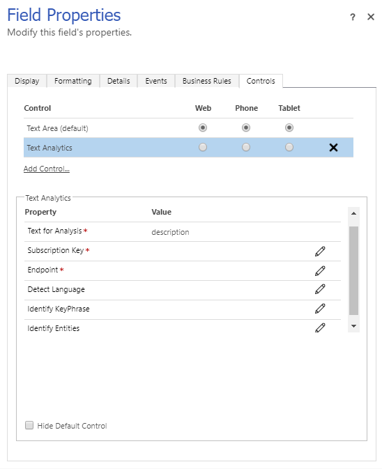

# TextAnalytics

A fully configurable PCF control that uses Azure Text Analytics Cognitive Service to evaluate Sentiment, Language, Key Phrases and Entities from a Text.

### Configure the control
Control has 5 configuration properities which are described below:

Configuration Property | Description | Required
------------ | ------------- | -------------
Subscription Key | Text Analytics Subscription Key | Yes
Endpoint | Text Analytics Endpoint | Yes
Detect Language | Determines if control should detect the language of the text | No
Identify KeyPhrase | Determines if control should identify the key phrases in the text | No
Identify Entities | Determines if control should identify the entities in the text. It also provides the wiki link (if available) | No

### Screenshot of the configuration

### Demo of the control

