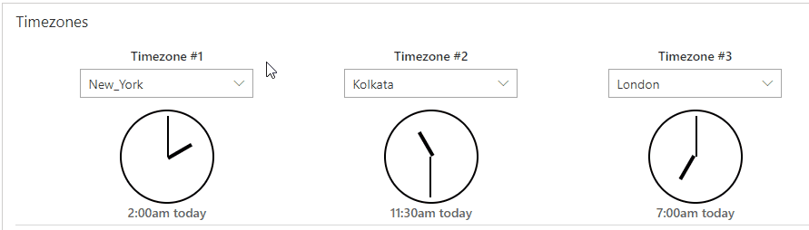

# Timezone Converter

PCF control that displays clocks with different timezones based on the configuration and selection. Time is converted from user's timezone setting. Configuration can be from 1 timezone clock displayed to maximum of 3 clocks.

Timezone selection is based on [IANA name](https://en.wikipedia.org/wiki/List_of_tz_database_time_zones).

### Configurations

Control has 5 configuration properities which are described below:

| Field | Description | Required |
| - | - | :-: |
| User Selected DateTime | A selected DateTime with respect to user&#39;s timezone | :heavy_check_mark: |
| Default Timezone #1 | Default Timezone #1 | :x: |
| Default Timezone #2 | Default Timezone #2 | :x: |
| Default Timezone #3 | Default Timezone #3 | :x: |
| Number of Timezones to Display | Select how many timezone options you want to dsiplay | :x: |

### Screenshot

### Demo of the control

### Ideas for additional features

- Instead of IANA name use friendly timezone names like EST, PST, IST, etc. or city names
- Display DayTime savings

> If you have any feature request then please create an issue with tag: `Timezone`
